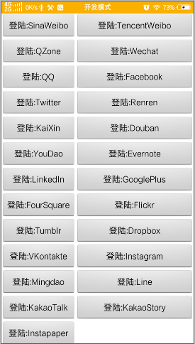

# ShareSDK社会化分享

## 第三方登录范例

修改LoginPage界面布局
  从单列，改为双列，避免翻屏。
---

### 效果


### code

```xml
<?xml version="1.0" encoding="utf-8"?>
<LinearLayout xmlns:android="http://schemas.android.com/apk/res/android"
    android:layout_width="match_parent"
    android:layout_height="match_parent"
    android:background="@android:color/white"
    android:orientation="vertical" >

    <ScrollView
        android:layout_width="match_parent"
        android:layout_height="match_parent" >

        <GridLayout
            android:id="@+id/llLayout"
            android:layout_width="match_parent"
            android:layout_height="wrap_content"
            />

    </ScrollView>
```

```java
  private void initPlatformList() {
        ShareSDK.initSDK(this);
        Platform[] Platformlist = ShareSDK.getPlatformList();

        if (Platformlist != null) {
            GridLayout gridLayout = (GridLayout) findViewById(R.id.llLayout);

            gridLayout.setColumnCount(2);
            gridLayout.setRowCount((Platformlist.length % 2) + (Platformlist.length >> 1) );
            gridLayout.setOrientation(GridLayout.HORIZONTAL);

            for (Platform platform : Platformlist) {
                if (!Tool.canGetUserInfo(platform)) {
                    continue;
                }

                if (platform instanceof CustomPlatform) {
                    continue;
                }

                Button btn = new Button(this);
                btn.setSingleLine();
                String platformName = platform.getName();

                Log.d(TAG, "platform:" + platformName);

                if (platform.isAuthValid()) {
                    btn.setText(getString(R.string.remove_to_format, platformName));
                } else {
                    btn.setText(getString(R.string.login_to_format, platformName));
                }

                btn.setTextSize(16);
                btn.setTag(platform);
                btn.setVisibility(View.VISIBLE);
                btn.setOnClickListener(this);
                gridLayout.addView(btn);

                ((GridLayout.LayoutParams)btn.getLayoutParams())
                        .setGravity(Gravity.FILL_HORIZONTAL);
            }


        }
    }
```